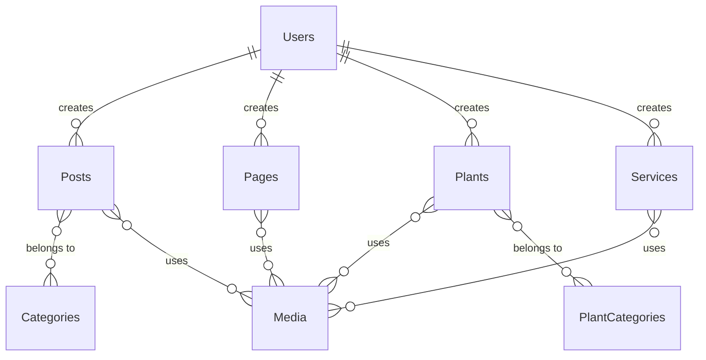

# PRD — KebunKumara Website on Payload CMS v3

> **Version:** 1.3 (Final)  
> **Date:** 2026-03-14  
> **Project:** [web-kebunkumara-payload](file:///c:/Projects/Personal/kebunkumara/web-kebunkumara-payload)  
> **Client:** Kebun Kumara  
> **Timeline:** 4 Weeks (1 Month)

---

## 1. Executive Summary

KebunKumara is a garden-education company based in South Tangerang/Jakarta. This PRD defines the implementation of their website using **Payload CMS v3** as the headless CMS backend, paired with a **Next.js 16 (App Router)** frontend. The existing frontend prototype (static React pages) will be migrated into a Payload-powered architecture where content is managed via an admin panel and rendered via server-side Next.js pages.

### Objective

Transform the existing static Next.js prototype into a fully CMS-driven website where the client can independently manage content (blog posts, plant stories, services, media assets, etc.) through Payload's admin panel — without touching code.

---

## 2. Current State Analysis

### 2.1 Existing Frontend Prototype

| Aspect | Details |
|:---|:---|
| **Framework** | Next.js 16.1.6 (App Router) + React 19 |
| **Styling** | TailwindCSS v4 + PostCSS |
| **UI Libraries** | Radix UI (`@radix-ui/react-slot`), CVA, Lucide Icons, Embla Carousel |
| **Fonts** | Lato (titles), Montserrat (body/paragraphs), Material Symbols Outlined |
| **Design Tokens** | Documented in [design-system.md](file:///c:/Projects/Personal/kebunkumara/web-kebunkumara-payload/docs/design-system.md) |

### 2.2 Existing Pages (Prototype, Static Data)

| Route | Type | Status |
|:---|:---|:---|
| `/` (Homepage) | Static → CMS-Enhanced | Hero, Why Garden section, About excerpt, Garden gallery, CTA |
| `/about` | Static | Team story, mission, values |
| `/why-garden` | Static | Why gardening matters |
| `/services/educational-program` | Static → CMS | Service detail page |
| `/services/landscaping-consultancy` | Static → CMS | Service detail page |
| `/services/garden-product` | Static → CMS | Service detail page |
| `/services/movement` | Static → CMS | Service detail page |
| `/kumara-plant-story` | Dynamic (mock) | Plant listing — Botanical Index |
| `/kumara-plant-story/[slug]` | Dynamic (mock) | Plant detail with gallery, care info, ecological role |
| `/blog` | Dynamic (mock) | Blog listing with categories |
| `/blog/[slug]` | Dynamic (mock) | Blog article detail |
| `/media` | Static → CMS | Media/gallery showcase |
| `/contact` | Static | Contact form + map |

### 2.3 Existing Components

| Component | Location |
|:---|:---|
| **Navbar** | [src/components/layout/Navbar.tsx](file:///c:/Projects/Personal/kebunkumara/web-kebunkumara-payload/src/components/layout/Navbar.tsx) |
| **Footer** | [src/components/layout/Footer.tsx](file:///c:/Projects/Personal/kebunkumara/web-kebunkumara-payload/src/components/layout/Footer.tsx) |
| **WhatsApp FAB** | [src/components/layout/WhatsAppFab.tsx](file:///c:/Projects/Personal/kebunkumara/web-kebunkumara-payload/src/components/layout/WhatsAppFab.tsx) |
| **GardenSlider** | [src/components/GardenSlider.tsx](file:///c:/Projects/Personal/kebunkumara/web-kebunkumara-payload/src/components/GardenSlider.tsx) |
| **Button** | [src/components/ui/button.tsx](file:///c:/Projects/Personal/kebunkumara/web-kebunkumara-payload/src/components/ui/button.tsx) (CVA-based) |
| **Badge** | [src/components/ui/badge.tsx](file:///c:/Projects/Personal/kebunkumara/web-kebunkumara-payload/src/components/ui/badge.tsx) |
| **ProgramImageSlider** | [src/components/ui/ProgramImageSlider.tsx](file:///c:/Projects/Personal/kebunkumara/web-kebunkumara-payload/src/components/ui/ProgramImageSlider.tsx) |
| **WhyGarden Sections** | `src/components/sections/WhyGarden*.tsx` (4 files) |

### 2.4 Known Issues (from [ui-audit.md](file:///c:/Projects/Personal/kebunkumara/web-kebunkumara-payload/docs/ui-audit.md))

- Inconsistent color tokens (multiple hardcoded hex values for primary greens)
- Mixed typography usage (`font-serif` vs `font-display`)
- Component duplication (no unified Card, Input components)
- Icons: mix of inline SVGs, Material Symbols, and emojis
- Heavy use of arbitrary Tailwind values instead of design tokens

---

## 3. Architecture — Payload CMS v3 Integration

### 3.1 High-Level Architecture

```
┌─────────────────────────────────────────────┐
│              Payload CMS v3                 │
│  ┌─────────────┐  ┌──────────────────────┐  │
│  │ Admin Panel  │  │   REST / GraphQL API │  │
│  │ (React)      │  │                      │  │
│  └─────────────┘  └──────────────────────┘  │
│         │                    │               │
│    ┌────┴────────────────────┴────┐          │
│    │  PostgreSQL + Drizzle ORM   │          │
│    └─────────────────────────────┘          │
└─────────────────────────────────────────────┘
                    │ API
┌───────────────────┴─────────────────────────┐
│         Next.js 16 Frontend (SSR/SSG)       │
│  ┌──────────────────────────────────────┐   │
│  │   Pages (App Router)                 │   │
│  │   - Static: /, /about, /why-garden   │   │
│  │   - Dynamic: /blog/*, /plants/*      │   │
│  │                                      │   │
│  │   Components (TailwindCSS v4)        │   │
│  └──────────────────────────────────────┘   │
└─────────────────────────────────────────────┘
```

### 3.2 Architecture: Monorepo (Confirmed ✅)

Payload v3 runs as a **Next.js plugin** (monorepo, single [next.config.ts](file:///c:/Projects/Personal/kebunkumara/web-kebunkumara-payload/next.config.ts)). Payload and the frontend share the same codebase, database connection, and deployment. This enables Live Preview, Draft Preview, and on-demand revalidation natively.

### 3.3 Database: PostgreSQL + Drizzle ORM (Confirmed ✅)

**PostgreSQL** with **Drizzle ORM** — ideal for structured relational data. Payload CMS v3's `@payloadcms/db-postgres` adapter uses Drizzle ORM internally for type-safe schema management and migrations.

- **Docker image:** `postgres:17-alpine` (lightweight ~80MB)
- **Local dev:** PostgreSQL via Docker container
- **Production:** PostgreSQL on the Dokploy server
- **ORM:** Drizzle (built into `@payloadcms/db-postgres`, auto-generates schema from Payload collections)

---

## 4. Payload CMS Collections

> [!NOTE]
> All field names below are the **admin-facing labels** — what the admin/editor will see in the CMS panel. These are written to be clear and intuitive for non-technical users.

### 4.1 Collections Overview



---

### 4.2 Collection: **Users**

**Purpose:** Admin & Editor login accounts  
**Auth:** ✅ Enabled

| Admin Label | Field Type | Required | Description |
|:---|:---|:---|:---|
| Email Address | email | ✅ | Used to log in |
| Full Name | text | ✅ | Displayed in the admin panel |
| Role | dropdown | ✅ | Choose: **Admin** or **Editor** |
| Profile Picture | image upload | — | Optional avatar |

**Access Control:**
- **Admin**: Can manage everything
- **Editor**: Can manage Blog, Plants, Media. Can view (but not edit) Pages & Services

---

### 4.3 Collection: **Pages**

**Purpose:** Static pages (Homepage, About, Why Garden)  
**Auto URL Slug:** ✅  
**Draft/Preview:** ✅  
**SEO:** ✅  
**Page Builder:** ✅

| Admin Label | Field Type | Required | Description |
|:---|:---|:---|:---|
| Page Title | text | ✅ | The title of the page |
| URL Slug | text (auto) | ✅ | Auto-generated from title, e.g. `about-us` |
| Hero Section | group | — | Top banner: Heading, Subheading, Background Image/Video, Button |
| Page Content | page builder | — | Build the page using content blocks (see §5) |
| Publish Date | date picker | — | When this page was published |
| SEO Settings | SEO group | — | Meta title, description, social image |

**Pre-seeded Pages:** Homepage, About Us, Why Garden

---

### 4.4 Collection: **Blog Posts**

**Purpose:** Articles and news  
**Auto URL Slug:** ✅  
**Draft/Preview:** ✅  
**SEO:** ✅

| Admin Label | Field Type | Required | Description |
|:---|:---|:---|:---|
| Article Title | text | ✅ | Title of the blog post |
| URL Slug | text (auto) | ✅ | Auto-generated, e.g. `tips-menanam-tomat` |
| Short Summary | textarea | — | Brief excerpt shown in the blog listing |
| Cover Image | image upload | — | Main image shown on the blog card & header |
| Article Body | rich text editor | ✅ | Write the full article content here |
| Categories | pick from list | — | Select one or more categories |
| Author | pick from users | ✅ | Who wrote this article |
| Publish Date | date picker | ✅ | When to publish |
| Reading Time (minutes) | number | — | Estimated minutes to read |
| SEO Settings | SEO group | — | Meta title, description, social image |

---

### 4.5 Collection: **Categories**

**Purpose:** Labels for organizing blog posts  
**Supports nesting:** ✅ (e.g., "Tips > Gardening Tips")

| Admin Label | Field Type | Required | Description |
|:---|:---|:---|:---|
| Category Name | text | ✅ | e.g., "Tips", "Community", "News" |
| URL Slug | text (auto) | ✅ | Auto-generated |
| Description | textarea | — | Optional description |
| Parent Category | pick from categories | — | Nest under another category |

---

### 4.6 Collection: **Plants** (Kumara Plant Story)

**Purpose:** Plant profiles for the Botanical Index  
**Auto URL Slug:** ✅  
**Draft/Preview:** ✅  
**SEO:** ✅

| Admin Label | Field Type | Required | Description |
|:---|:---|:---|:---|
| Common Name | text | ✅ | e.g., "Swiss Cheese Plant" |
| Scientific Name | text | ✅ | e.g., "Monstera deliciosa" |
| URL Slug | text (auto) | ✅ | Auto-generated from common name |
| Plant Family | text | — | e.g., "Araceae" |
| Origin / Native Region | textarea | — | Where the plant is originally from |
| Main Photo | image upload | ✅ | Primary plant photo |
| Photo Gallery | multiple images | — | Additional photos for the image slider |
| **Care Guide** | — | — | *(section header)* |
| ↳ Sunlight Needs | text | — | e.g., "Bright, indirect light" |
| ↳ Watering | text | — | e.g., "Water weekly, allow soil to dry" |
| ↳ Soil Type | text | — | e.g., "Well-draining peat mix" |
| ↳ Temperature | text | — | e.g., "18–30°C" |
| ↳ Humidity | text | — | e.g., "Medium to high" |
| Ecological Role | rich text editor | — | Describe the plant's contribution to the ecosystem |
| **Designer's Note** | — | — | *(section header)* |
| ↳ Quote | textarea | — | The designer's comment about this plant |
| ↳ Author | text | — | Name of the designer/team |
| Plant Type | pick from list | — | e.g., Ornamental, Shade-loving, Edible |
| Publish Date | date picker | — | |
| SEO Settings | SEO group | — | Meta title, description, social image |

---

### 4.7 Collection: **Plant Types**

**Purpose:** Labels for organizing plants

| Admin Label | Field Type | Required | Description |
|:---|:---|:---|:---|
| Type Name | text | ✅ | e.g., "Ornamental", "Shade-loving", "Edible" |
| URL Slug | text (auto) | ✅ | Auto-generated |
| Description | textarea | — | Optional |

---

### 4.8 Collection: **Services**

**Purpose:** Service pages (Educational Program, Landscaping, Garden Products, Movements)  
**Auto URL Slug:** ✅  
**Draft/Preview:** ✅  
**SEO:** ✅  
**Page Builder:** ✅

| Admin Label | Field Type | Required | Description |
|:---|:---|:---|:---|
| Service Name | text | ✅ | e.g., "Educational Program" |
| URL Slug | text (auto) | ✅ | e.g., `educational-program` |
| Service Category | dropdown | ✅ | Choose: Educational Program, Landscaping Consultancy, Garden Product, or Movement |
| Short Description | textarea | — | Brief text for the service card on the listing page |
| Cover Image | image upload | — | Main image for card & hero |
| Page Content | page builder | — | Build the service page using content blocks |
| Publish Date | date picker | — | |
| Display Order | number | — | Controls the order on the services listing page |
| SEO Settings | SEO group | — | Meta title, description, social image |

---

### 4.9 Collection: **Media Library**

**Purpose:** Central place to manage all images, videos, and files  
**Upload:** ✅

| Admin Label | Field Type | Required | Description |
|:---|:---|:---|:---|
| Alt Text | text | ✅ | Describe the image (for accessibility & SEO) |
| Caption | text | — | Optional caption shown below the image |
| Photo Credit | text | — | Photographer or source credit |

**Auto-generated image sizes:**

| Size Name | Dimensions | Used For |
|:---|:---|:---|
| Thumbnail | 300 × 300 | Small previews, cards |
| Card | 600 × 400 | Blog & plant listing cards |
| Hero | 1920 × 1080 | Full-width hero banners |
| Social Share | 1200 × 630 | Open Graph / social media previews |

---

### 4.10 Collection: **Portfolio** (Projects / Media Page)

**Purpose:** Showcase completed garden projects & installations  
**Auto URL Slug:** ✅  
**Draft/Preview:** ✅

| Admin Label | Field Type | Required | Description |
|:---|:---|:---|:---|
| Project Name | text | ✅ | Name of the project |
| URL Slug | text (auto) | ✅ | Auto-generated |
| Client Name | text | — | Who the project was for |
| Location | text | — | Where the project took place |
| Year Completed | number | — | e.g., 2025 |
| Project Description | rich text editor | — | Detailed write-up |
| Cover Image | image upload | ✅ | Main project photo |
| Photo Gallery | multiple images | — | Additional project photos |
| Related Services | pick from services | — | Link to relevant services |
| Publish Date | date picker | — | |
| SEO Settings | SEO group | — | Meta title, description, social image |

---

### 4.11 Collection: **Contact Messages**

**Purpose:** Stores messages sent via the contact form  
**Admin access:** View only (messages come from the website contact form)

| Admin Label | Field Type | Required | Description |
|:---|:---|:---|:---|
| Sender Name | text | ✅ | Name of the person who contacted |
| Email Address | email | ✅ | Their email |
| Phone Number | text | — | Optional phone |
| Subject | text | — | What the message is about |
| Message | textarea | ✅ | The full message content |
| Status | dropdown | — | **New**, **Read**, or **Replied** |
| Received On | date (auto) | ✅ | Automatically set when submitted |

---

## 5. Page Builder Blocks

These reusable content blocks let admins build flexible page layouts for Pages and Services:

| Block Name | What It Does | What Admin Fills In |
|:---|:---|:---|
| **Hero Banner** | Full-width banner at the top of a page | Heading, Subheading, Background Image or Video, Button Text, Button Link, Style (centered / left-aligned / overlay) |
| **Text Content** | Rich text section | Write content using the editor, choose 1, 2, or 3 column layout |
| **Image / Video** | Embed an image or video | Pick from Media Library, add Caption, choose layout (full-width / inset / float) |
| **Call to Action** | Highlighted banner to prompt user action | Heading, Description, Primary Button (text + link), Secondary Button, Background Color |
| **Image Gallery** | Carousel or grid of images | Pick images from Media Library, choose layout (carousel / grid / masonry) |
| **Service Cards** | Grid of service cards | Pick which services to show, choose 2, 3, or 4 columns |
| **Testimonials** | Client quotes slider | Add quotes with Author Name, Role, and Photo |
| **Map** | Embedded Google Map | Paste Google Maps embed URL, add Label, set Height |
| **Key Numbers** | Showcase stats or achievements | Add items with: Number, Label, Icon |
| **FAQ** | Collapsible questions & answers | Section title, add pairs of Question and Answer |

---

## 6. Globals (Site-Wide Settings)

### 6.1 **Header / Navigation**

| Admin Label | Field Type | Description |
|:---|:---|:---|
| Site Logo | image upload | Logo displayed in the navigation bar |
| Navigation Links | list | Each link: Label + URL + optional sub-links (dropdown) |
| Action Button | group | Button in the nav bar: Label + URL (e.g., "Contact") |

### 6.2 **Footer**

| Admin Label | Field Type | Description |
|:---|:---|:---|
| Footer Logo | image upload | Optional logo in the footer |
| Tagline | text | Company tagline text |
| Footer Columns | list | Each column: Title + list of links (Label + URL) |
| Social Media Links | list | Platform name + URL |
| Show Newsletter Form | toggle | Show or hide the email newsletter form |
| Copyright Text | text | e.g., "© 2026 Kebun Kumara. All rights reserved." |

### 6.3 **Site Settings**

| Admin Label | Field Type | Description |
|:---|:---|:---|
| Site Name | text | "Kebun Kumara" |
| Site Description | textarea | Default description for SEO |
| WhatsApp Number | text | Phone number for the floating WhatsApp button |
| Google Maps Embed URL | text | Default map embed code |
| Analytics Tracking ID | text | Umami analytics tracking ID |
| Social Media Links | group | Instagram, YouTube, TikTok, LinkedIn URLs |

---

## 7. Frontend Routes & Data Flow

| Page | Where Data Comes From | How It Renders | Notes |
|:---|:---|:---|:---|
| **Homepage** `/` | Pages (slug: `home`) + Globals | Static + auto-refresh | Refreshes when content is published |
| **About** `/about` | Pages (slug: `about`) | Static + auto-refresh | |
| **Why Garden** `/why-garden` | Pages (slug: `why-garden`) | Static + auto-refresh | |
| **Services** `/services` | Services (listing) | Static + auto-refresh | Service landing page |
| **Service Detail** `/services/[slug]` | Services (by URL slug) | Static + auto-refresh | Individual service page |
| **Plant Index** `/kumara-plant-story` | Plants (listing) | Static + auto-refresh | Botanical directory |
| **Plant Detail** `/kumara-plant-story/[slug]` | Plants (by URL slug) | Static + auto-refresh | Individual plant profile |
| **Blog** `/blog` | Blog Posts (listing, paginated) | Static + auto-refresh | With category filters |
| **Blog Article** `/blog/[slug]` | Blog Posts (by URL slug) | Static + auto-refresh | Individual article |
| **Portfolio** `/media` | Portfolio (listing) | Static + auto-refresh | Project gallery |
| **Contact** `/contact` | Site Settings | Static | Form sends to Contact Messages |

---

## 8. SEO Strategy

| Feature | How It Works |
|:---|:---|
| **Page Title** | Auto-filled from the content title, can be overridden in SEO Settings |
| **Search Description** | Auto-filled from the short summary, can be overridden |
| **Social Share Image** | Uses the Cover Image by default, can be overridden |
| **URL Slugs** | Auto-generated from titles, editable, checked for uniqueness |
| **Sitemap** | Automatically generated XML sitemap |
| **Robots.txt** | Auto-generated |
| **Canonical URLs** | Automatically set per page |
| **Structured Data** | JSON-LD for LocalBusiness, BlogPosting, Article |

---

## 9. Design System Integration

### 9.1 Brand Colors

| Name | Color Code | Used For |
|:---|:---|:---|
| Primary Green | `#4F772D` | Buttons, active states, brand identity |
| Secondary Green | `#90A955` | Light green accents, highlights |
| Earthy Gold | `#d4a373` | Decorative accents, borders |
| Warm White | `#FAFAF8` | Page background |
| Soft Black | `#1A1C18` | Body text |
| Muted Beige | `#F3F1E8` | Section backgrounds, cards |

### 9.2 Typography

| Usage | Font |
|:---|:---|
| Titles & Headings | **Lato** (sans-serif) |
| Body / Paragraphs | **Montserrat** (sans-serif) |

### 9.3 Cleanup Needed (from [ui-audit.md](file:///c:/Projects/Personal/kebunkumara/web-kebunkumara-payload/docs/ui-audit.md))

- ✅ Consolidate all hardcoded color values to CSS variables
- ✅ Standardize shared components (Button, Card, Input, Badge)
- ✅ Replace inline SVGs with Lucide React icons
- ✅ Normalize heading sizes and font usage

---

## 10. Project Timeline

### Week 1: Setup + Core CMS

| Day | Task |
|:---|:---|
| D1–D2 | Payload CMS v3 setup (install, configure, database), finalize sitemap |
| D3–D4 | Build all collection schemas + global settings in Payload |
| D5 | Seed initial data, configure admin & editor accounts |

### Week 2: Static Pages + Services

| Day | Task |
|:---|:---|
| D1–D2 | Build Page Builder blocks (Hero, Content, Media, CTA, Gallery) |
| D3 | Migrate Homepage, About, Why Garden to CMS-driven pages |
| D4 | Build Services listing + detail pages |
| D5 | Navbar/Footer from Globals, design token cleanup |

### Week 3: Dynamic Content + Forms

| Day | Task |
|:---|:---|
| D1–D2 | Blog listing + article pages with rich text editor |
| D3 | Plant Story listing + detail pages |
| D4 | Portfolio page, Contact form → saves to Contact Messages |
| D5 | Site search integration |

### Week 4: UAT + SEO + Go-Live

| Day | Task |
|:---|:---|
| D1 | SEO: meta tags, sitemap, robots, structured data |
| D2 | Responsive testing (mobile/tablet/desktop), performance |
| D3 | Client testing (UAT), admin training session |
| D4 | Bug fixes, final polish |
| D5 | Go-live, DNS setup, Umami analytics setup |

---

## 11. Deployment & Infrastructure

### 11.1 Local Development (Phase 1)

| Component | Setup |
|:---|:---|
| **App Server** | `npm run dev` — Next.js dev server with Payload admin |
| **Database** | PostgreSQL 17 Alpine (`postgres:17-alpine` Docker) + Drizzle ORM |
| **Media Storage** | Local disk (`/public/media`) |
| **Admin Panel** | `http://localhost:3000/admin` |
| **Frontend** | `http://localhost:3000` |

### 11.2 Production — Dokploy (Phase 2)

| Component | Setup |
|:---|:---|
| **Hosting** | Dokploy (self-hosted, Docker-based) |
| **Database** | PostgreSQL 16 Alpine + Drizzle ORM (Docker service on Dokploy) |
| **Media Storage** | Local disk with Docker volume (or S3-compatible later) |
| **Analytics** | Umami (self-hosted on Dokploy) |
| **Email** | Company email setup + Gmail integration |
| **SSL** | Let's Encrypt (auto via Dokploy / Traefik) |
| **Domain** | `kebunkumara.id` |
| **Reverse Proxy** | Traefik (built into Dokploy) |

---

## 12. Out of Scope

| Item | Notes |
|:---|:---|
| E-commerce | No cart, payment, or shipping |
| Third-party integrations | No external API integrations |
| Multi-language (ID/EN) | Unless agreed upon, content provided by client |
| Photography/Videography | Client provides content |
| Full copywriting | Client provides copy |

---

## 13. Free Services Included

- ✅ Free website hosting during development phase
- ✅ Umami analytics setup & hosting
- ✅ Company email setup + Gmail integration (if needed)
- ✅ Admin documentation: how to update Blog, Plants, Media, Products
- ✅ 3 months post-launch consultation

---

## 14. Success Criteria

| Criteria | Metric |
|:---|:---|
| All pages render from CMS content | 100% pages CMS-driven |
| Admin can create/edit blog posts | Rich text editor working |
| Admin can manage plant profiles | Full create/edit/delete with gallery |
| Mobile responsive | Passes Google Mobile Friendly test |
| SEO baseline | All pages have title, description, social share image |
| Page load performance | < 3s load time on 3G connection |
| Admin training completed | Client documentation delivered |
